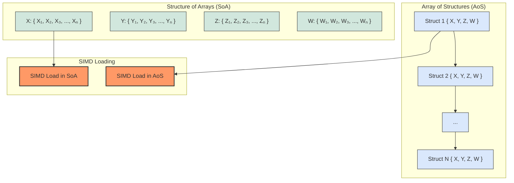
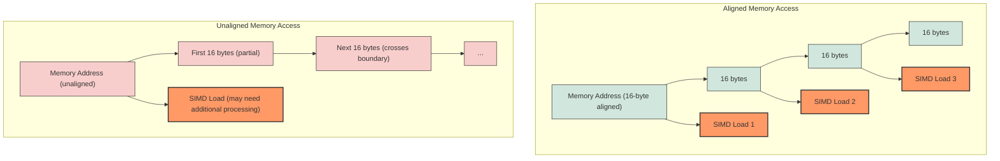
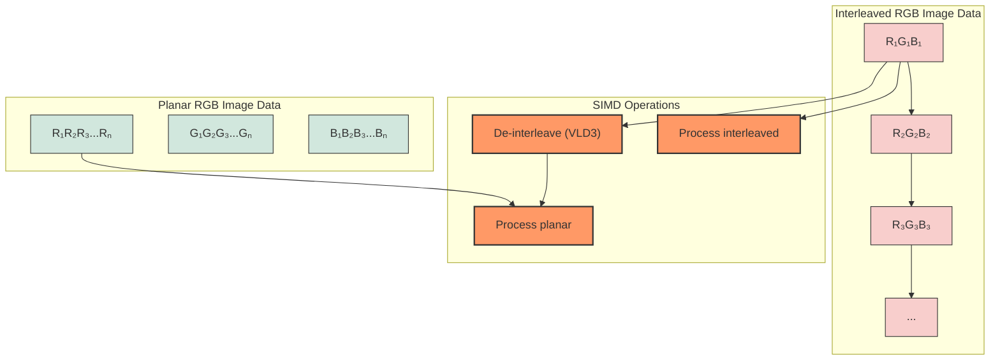
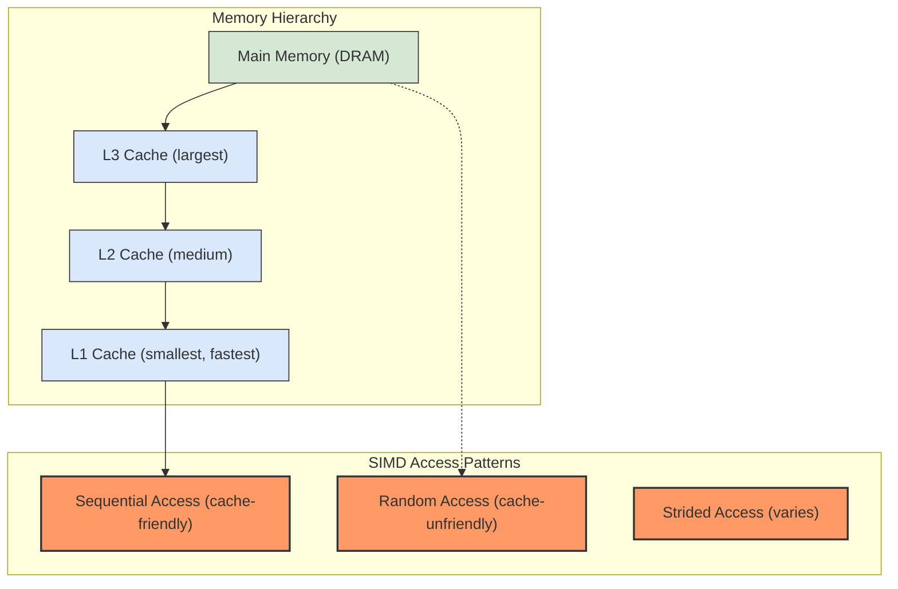

# Memory Layout Visualizations

Different memory layouts and their impact on SIMD operations.

## Array of Structures vs. Structure of Arrays

## Memory Alignment

## Interleaved vs. Planar Image Data

## Cache Considerations

