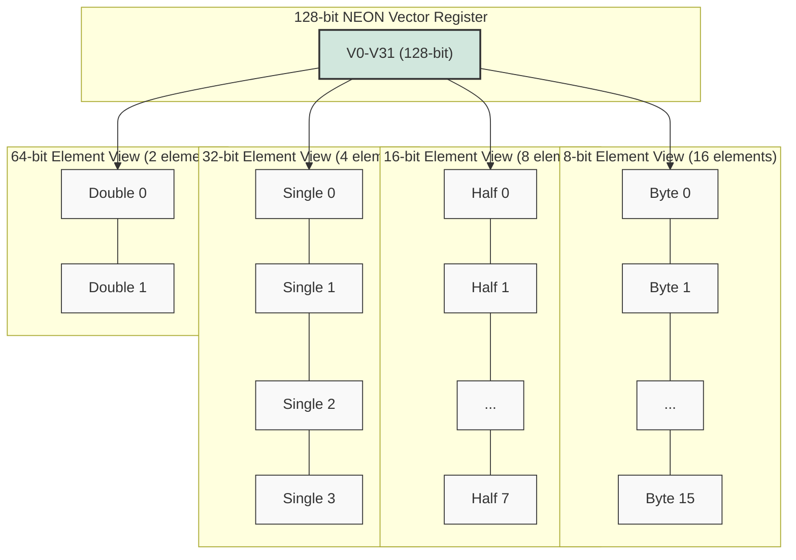
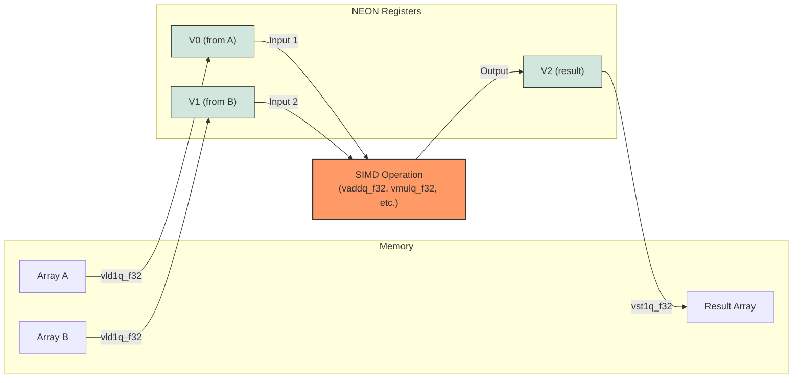
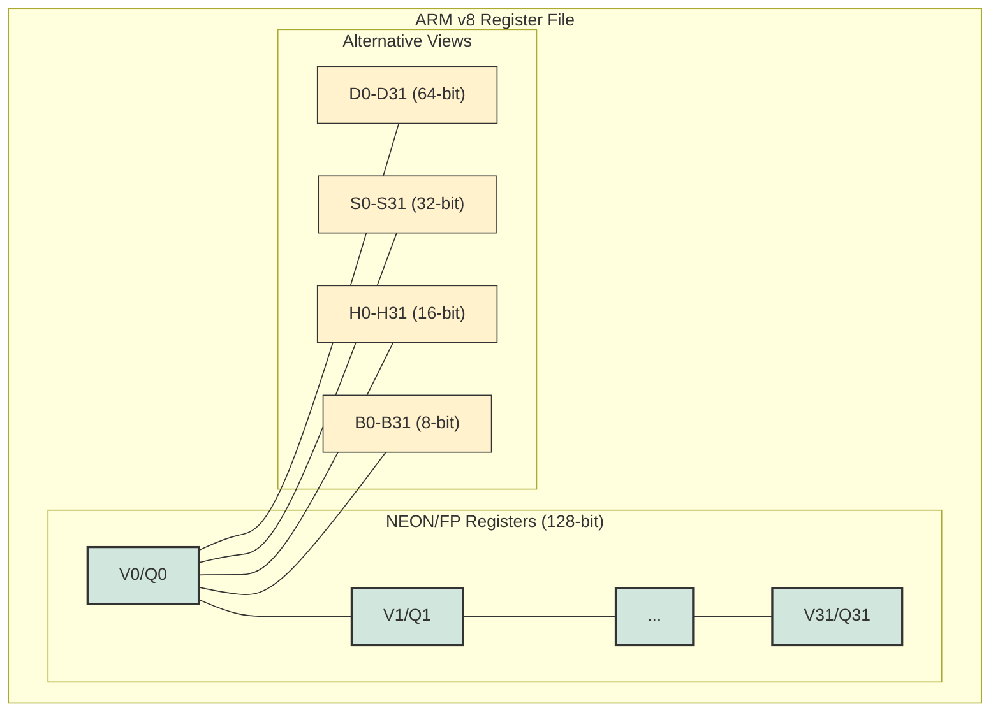
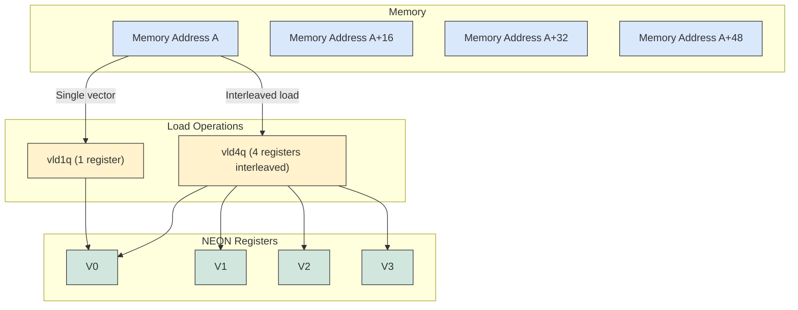

# ARM NEON Register Visualization

These diagrams visually represent how ARM NEON registers work and how data is organized within them.

## Basic Register Layout

## Data Arrangement Specifiers

```mermaid
graph TD
    subgraph "NEON Register Layout Examples"
        subgraph "8B Arrangement (8 bytes in 64-bit register)"
            B8_0["B0"] --- B8_1["B1"] --- B8_2["B2"] --- B8_3["B3"] --- B8_4["B4"] --- B8_5["B5"] --- B8_6["B6"] --- B8_7["B7"]
        end
        
        subgraph "16B Arrangement (16 bytes in 128-bit register)"
            B16_0["B0"] --- B16_1["B1"] --- B16_2["..."] --- B16_15["B15"]
        end
        
        subgraph "4H Arrangement (4 half-words in 64-bit register)"
            H4_0["H0"] --- H4_1["H1"] --- H4_2["H2"] --- H4_3["H3"]
        end
        
        subgraph "8H Arrangement (8 half-words in 128-bit register)" 
            H8_0["H0"] --- H8_1["H1"] --- H8_2["..."] --- H8_7["H7"]
        end
        
        subgraph "2S Arrangement (2 words in 64-bit register)"
            S2_0["S0"] --- S2_1["S1"]
        end
        
        subgraph "4S Arrangement (4 words in 128-bit register)"
            S4_0["S0"] --- S4_1["S1"] --- S4_2["S2"] --- S4_3["S3"]
        end
        
        subgraph "1D Arrangement (1 double-word in 64-bit register)"
            D1_0["D0"]
        end
        
        subgraph "2D Arrangement (2 double-words in 128-bit register)"
            D2_0["D0"] --- D2_1["D1"]
        end
    end
    
    classDef default fill:#f9f9f9,stroke:#333,stroke-width:1px;
    classDef byte fill:#d1e7dd,stroke:#333,stroke-width:1px;
    classDef half fill:#fff2cc,stroke:#333,stroke-width:1px;
    classDef single fill:#dae8fc,stroke:#333,stroke-width:1px;
    classDef double fill:#ffe6cc,stroke:#333,stroke-width:1px;
    
    class B8_0,B8_1,B8_2,B8_3,B8_4,B8_5,B8_6,B8_7,B16_0,B16_1,B16_2,B16_15 byte;
    class H4_0,H4_1,H4_2,H4_3,H8_0,H8_1,H8_2,H8_7 half;
    class S2_0,S2_1,S4_0,S4_1,S4_2,S4_3 single;
    class D1_0,D2_0,D2_1 double;
```

## SIMD Operation Flow

## NEON Register File

## Load/Store Operations

