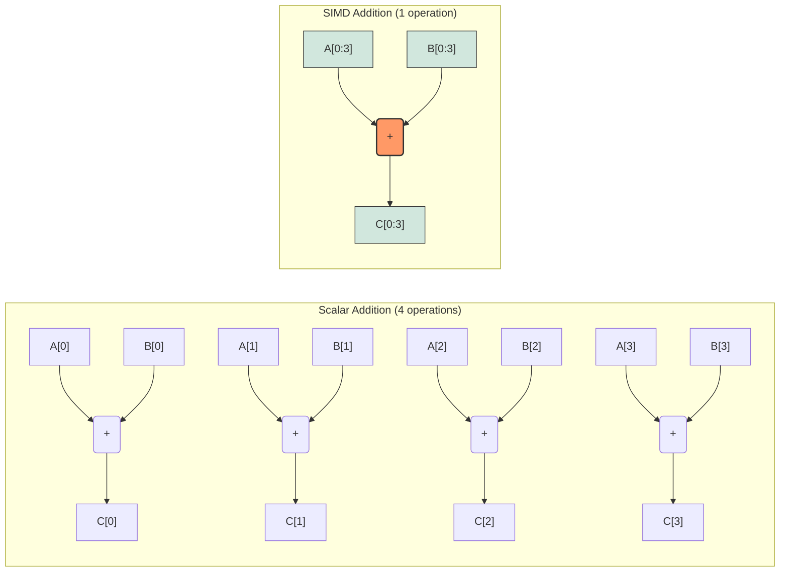
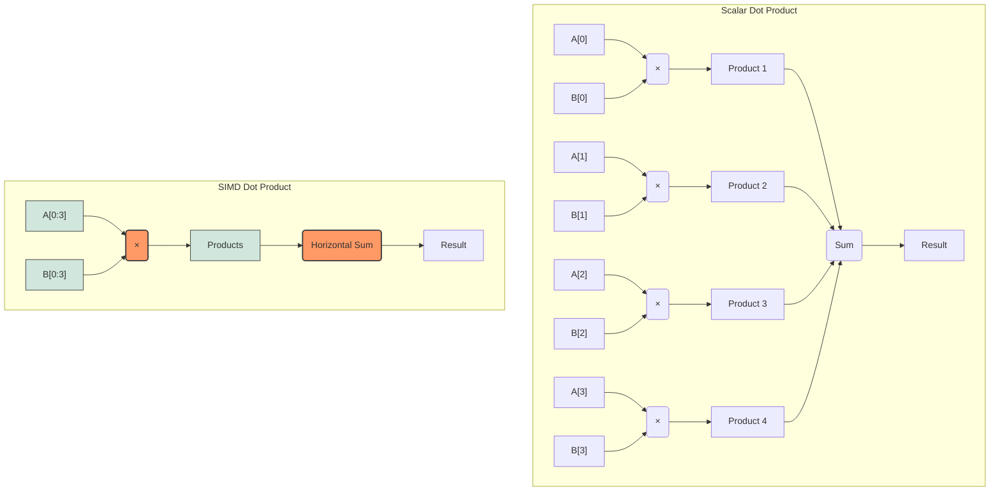
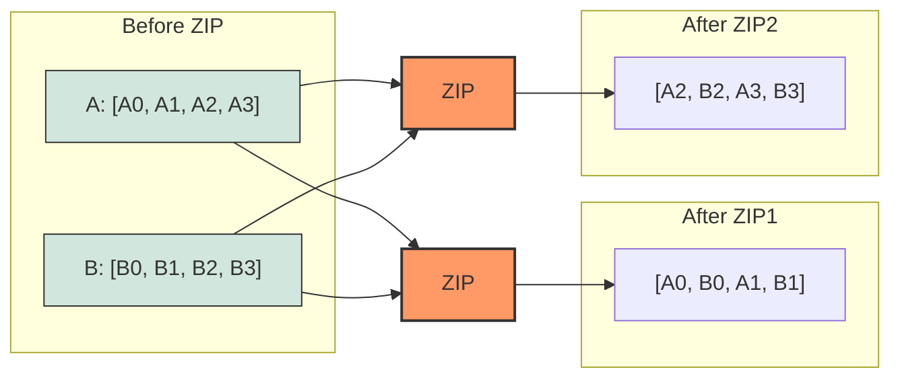
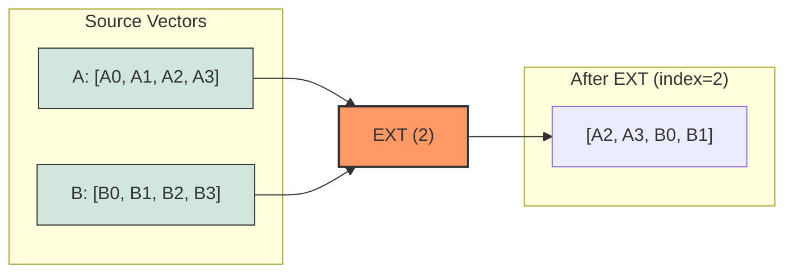
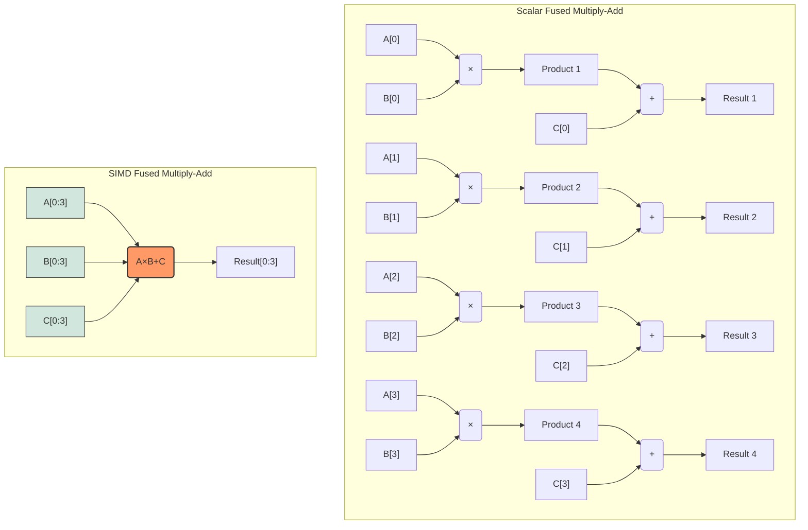

# SIMD Operation Visualizations

Visual representations of how SIMD operations work compared to scalar operations.

## Vector Addition

## Vector Dot Product

## Vector Interleaving Operation

## Vector Element Extraction

## Fused Multiply-Add

